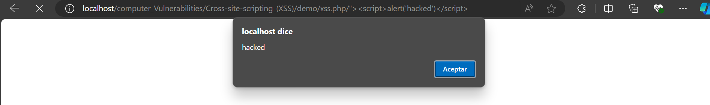

# Cross-site Scripting (XSS)

Es un tipo de vulnerabilidad que comunmente es encontrado en aplicaciones web. XSS Abre a los atacantes la posibilidad de inyectar scripts de lado del cliente en paginas web que pueden ver otros usuarios.

A continuacion te muestro distintos ejemplos donde es aplicado el XSS y sus implicaciones en el codigo:

1. Tenemos el siguientes script php llamado ``` xss.php ``` el cual se conforma del siguiente codigo.
    ~~~~~
     <form  method="post" action="<?php echo $_SERVER['PHP_SELF'];?>">
        Name: <input type="text" name="name">
        E-mail: <input type="text" name="email">
        <button type="submit">Enviar</button>
    </form>
    ~~~~~
    Como podemos observar usamos la constante ``` echo $_SERVER_['PHP_SELF']``` para acceder al propio archivo php y ejecutar la logica que tenemos despues.

    No tenemos problema hasta que notamos nuestra URL de la siguiente forma:
    
        http://localhost/xss.php/

    como podemos ver hacemos referencia al mismo archivo, por lo que si intentamos inyectar una cadena similar a esta en nuestra URL:

        http://localhost/xss.php/%22%3E%3Cscript%3Ealert('Mi alerta')%3C/script%3E

    Veremos algo similar a esto al dar entrar a esta URL:

    

    Cosa que no deberia suceder, ya que esto puede inducir a atacantes el poder manipular informacion sensible del usuario a travez de una inyeccion de codigo JavaScript.

    Una forma de evitar este problema es usando el metodo ```htmlspecialcharts()``` el cual podemos implementar para filtrar caracteres HTML que intenten acceder por nuestra URL o formulario y cambiarlos por entidades HTML. Por lo que si el usuario intenta explotar esta vulnerabilidad con esta variable obtendra algo similar a esto: 
    
    ~~~
    <form method="post" action="xss.php/&quot;&gt;&lt;script&gt;alert('hacked')&lt;/script&gt;"> 
    ~~~

    Por lo cual no tendra forma de explotar esta vulnerabilidad.

    Es recomendable el aplicar este filtro a todas las variables que lleguen como entradas del usuario, por lo que aplicar este metodo a todas los valores del arreglo ``` $_POST[] ``` O ``` $_GET[] ``` no quedaria nada mal.

    Por ultimo podemos agregar mas validaciones para las cadenas que inserte el usuario, para esto podemos crear una funcion que nos ayude en esta tarea: 
    ~~~
        function test_input($user_data){
        $user_data = trim($user_data);
        $user_data = stripcslashes($user_data);
        $user_data = htmlspecialchars($user_data);
        return $user_data;
        }
    ~~~
    Esta funcion podemos personalizarla conforme a las necesidades que se requieran.

    


    